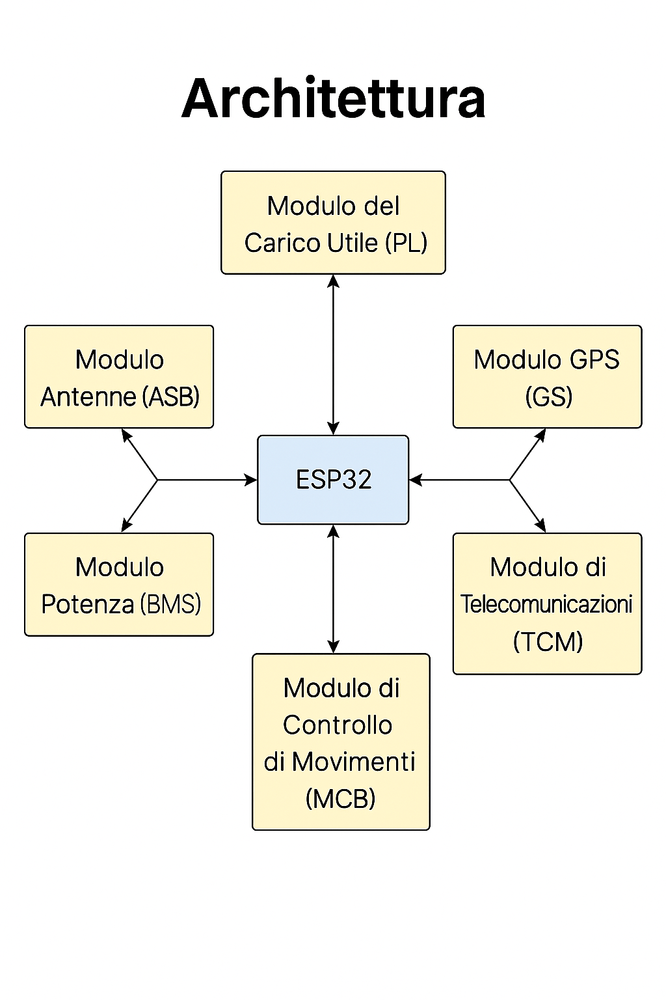

# PayloadX – Modular Firmware Architecture

This document outlines the modular architecture of the PayloadX firmware, forked from EdgeFlyte’s CubeSat v1.

---

## 📦 Main Modules

| Module          | Description |
|-----------------|-------------|
| `imu.cpp` / `imu.h`     | Initializes and reads IMU data (accelerometer, gyroscope, magnetometer) |
| `gps.cpp` / `gps.h`     | Initializes and reads GPS data (latitude, longitude, altitude, etc.) |
| `radio.cpp` / `radio.h` | Handles NRF24 radio communication |
| `bms.cpp` / `bms.h`     | Parses messages from the Battery Management System |
| `main.cpp`              | Main logic loop: reads, processes and transmits data |
| `CubeSat.ino`           | Entry point for Arduino IDE |

---

## 🔁 Simplified Data Flow

```mermaid
graph TD;
  A[setup()] --> B[initIMU()]
  A --> C[initGPS()]
  A --> D[initRadio()]

  loop[loop()] --> E[readIMUData()]
  loop --> F[readGPSData()]
  loop --> G[sendTelemetry()]


