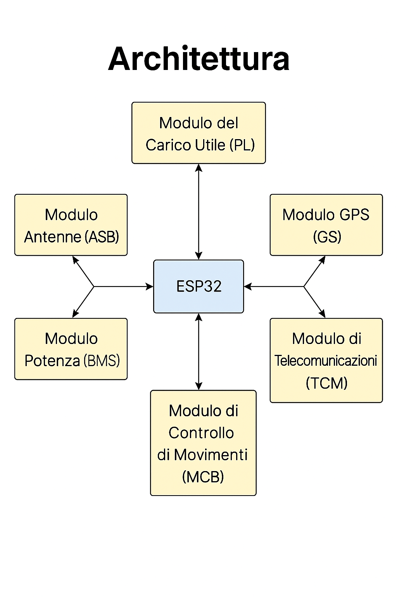

# Architettura del Sistema – PayloadX

Questo documento descrive l’architettura modulare del firmware PayloadX, fork del progetto CubeSat v1 di EdgeFlyte.

---

## 📦 Moduli principali

| Modulo               | Descrizione |
|----------------------|-------------|
| `imu.cpp` / `imu.h`  | Lettura dati dall'IMU (accelerometro, giroscopio, magnetometro) |
| `gps.cpp` / `gps.h`  | Lettura dati GPS: coordinate, altitudine, velocità, satelliti |
| `radio.cpp` / `radio.h` | Gestione della comunicazione radio NRF24 |
| `bms.cpp` / `bms.h`  | Decodifica dei messaggi dal sistema di gestione batteria (BMS) |
| `main.cpp`           | Ciclo principale: lettura sensori e invio telemetria |
| `CubeSat.ino`        | Entry point per Arduino IDE che include tutti i moduli |

---

## 🔁 Flusso del sistema

L'immagine seguente mostra il flusso dei dati dal sensore fino alla trasmissione:

---

## 📄 Licenza

Fork del progetto originale [EdgeFlyte CubeSat v1](https://github.com/edgeflyte/CubeSatV1).  
Distribuito sotto licenza **GNU GPL v3**.  
Manutenuto da **PezzaliStack** come parte dell’iniziativa open-source **PayloadX**.
